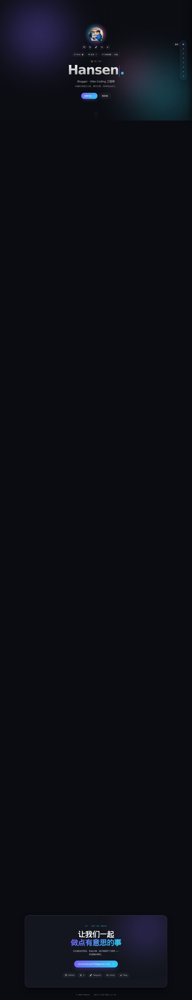
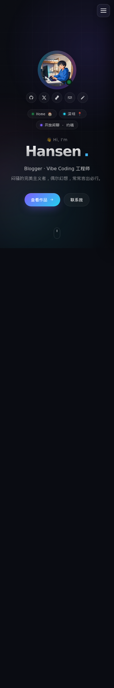
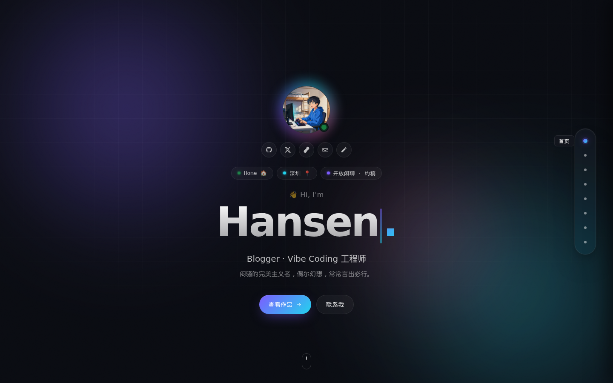
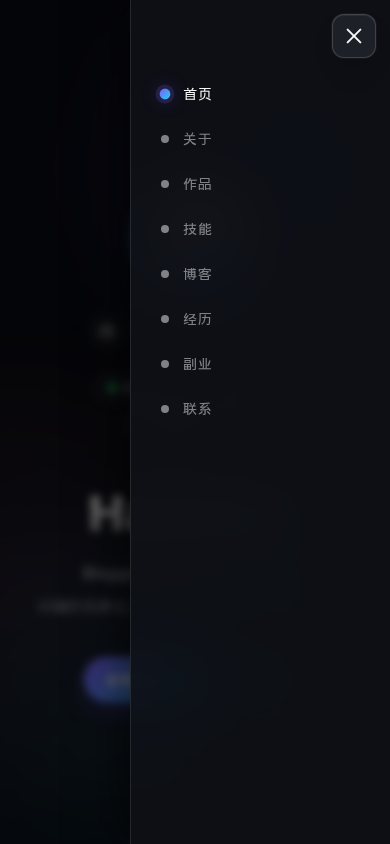

# Hansen Web · 个人主页

> [English](./README.md) | 中文

基于 **Next.js App Router + React + TypeScript** 构建的个人主页。玻璃拟态设计 + 极光氛围背景 + Hugo 博客构建期联动。

**在线访问**：https://hansendong.top

---

## 预览

| 桌面端 | 移动端 |
| --- | --- |
|  |  |

桌面端首屏：



移动端菜单：



---

## 功能特性

- **Next.js App Router** + `output: 'export'` —— 纯静态站点，零运行时成本
- **React** 默认走服务端组件；13 个组件里只有 5 个需要打包客户端 JS
- **TypeScript strict** —— 数据、Hook、组件全程类型安全
- **玻璃拟态 + 极光背景** —— 三团漂浮的径向光晕 + 颗粒噪点叠加 + `backdrop-filter` 玻璃卡片
- **滚动监听** —— 单一 `IntersectionObserver` 同时驱动桌面 `SideNav` 和移动端 `MobileMenu`（`NavController` 封装）
- **Hero 打字机** —— `type → pause → delete` 状态机，带 `prefers-reduced-motion` 守卫
- **博客 Feed 同步** —— `scripts/fetch-blog-feed.mjs` 构建期抓 Hugo 博客 → `public/blog-feed.json`
- **Open Graph + JSON-LD** —— 完整的元数据 API：`Person` + `WebSite` + `WebPage` 结构化数据
- **移动优先响应式** —— 断点 640 / 720 / 900 / 1180 px

## 技术栈

| 层 | 工具 | 版本 |
| --- | --- | --- |
| 框架 | Next.js（App Router，`output: 'export'`） | — |
| UI | React + react-dom | — |
| 语言 | TypeScript（strict） | — |
| 样式 | 原生 CSS · BEM 命名 | — |
| 图片生成 | sharp（SVG → PNG for `og.png`） | — |
| RSS / 博客 feed | Hugo 博客 → JSON（构建期拉取） | — |
| 部署 | `rsync` over SSH → `/var/www/hansen-web/` | — |

## 快速开始

```bash
npm install
npm run dev        # http://localhost:5173
npm run build      # 输出到 out/
```

`npm run build` 会先跑两个 prebuild 步骤：

```
prebuild
├── scripts/gen-og.mjs           # public/og.svg → public/og.png（1200×630）
└── scripts/fetch-blog-feed.mjs  # blog.hansendong.top/index.json → public/blog-feed.json
```

## 项目结构

```
hansen-web-next/
├── package.json
├── next.config.mjs        # output: 'export' + images.unoptimized
├── tsconfig.json          # strict 模式，@/* 路径别名
├── deploy.sh              # 原子替换 + rsync
├── public/                # favicon、og.svg、blog-feed.json（构建后产物）
├── scripts/
│   ├── gen-og.mjs         # SVG → PNG
│   └── fetch-blog-feed.mjs # Hugo 博客 → JSON
├── screenshots/           # README 截图（desktop / mobile）
└── src/
    ├── app/
    │   ├── layout.tsx     # metadata + JSON-LD
    │   ├── page.tsx       # 组合所有 section
    │   └── globals.css    # CSS 变量 + reset
    ├── components/
    │   ├── NavController.tsx       # client —— scroll-spy 调度
    │   ├── SideNav.tsx             # server —— 纯展示
    │   ├── MobileMenu.tsx          # client —— 抽屉 + body 滚动锁
    │   ├── SectionShell.tsx        # client —— IntersectionObserver 渐入
    │   ├── BackgroundLayer.tsx     # server —— 纯 CSS 动画
    │   ├── HeroSection.tsx         # client —— 打字机
    │   ├── AboutSection.tsx        # server —— 纯展示
    │   ├── ProjectsSection.tsx     # client —— onError 处理器
    │   ├── SkillsSection.tsx       # server —— 纯展示
    │   ├── BlogSection.tsx         # client —— 挂载时 fetch
    │   ├── TimelineSection.tsx     # server —— 纯展示
    │   ├── SideHustleSection.tsx   # server —— 纯展示
    │   ├── ContactSection.tsx      # server —— 纯展示
    │   └── socialIcons.ts          # 共享 SVG path
    ├── data/
    │   └── profile/                # 全部内容，按 section 拆分的文件
    │       ├── index.ts            # Profile interface + 顶部字段 + socials + navSections + aggregator
    │       ├── about.ts            # {intro, paragraphs, highlights}
    │       ├── projects.ts         # Project[]
    │       ├── skills.ts           # SkillGroup[]
    │       ├── side-hustles.ts     # SideHustle[]
    │       ├── blog.ts             # BlogConfig
    │       └── timeline.ts         # TimelineEntry[]
    ├── hooks/
    │   └── useActiveSection.ts     # scroll-spy 状态机
    └── styles/
        ├── background-layer.css            # BackgroundLayer + aurora
        ├── side-nav.css                    # SideNav
        ├── mobile-menu.css                 # MobileMenu
        ├── section-shell.css               # SectionShell
        ├── about-section.css               # AboutSection
        ├── hero-section.css                # HeroSection
        ├── projects-section.css            # ProjectsSection
        ├── skills-section.css              # SkillsSection
        ├── blog-section.css                # BlogSection
        ├── timeline-section.css            # TimelineSection
        ├── side-hustle-section.css         # SideHustleSection
        ├── contact-section.css             # ContactSection
        ├── theme-toggle.css                # ThemeToggle
        └── utilities.css                   # Page wrapper
                                          # 在 layout.tsx 中分别导入
                                          # （Turbopack 不解析 CSS @import）
```

## 架构

### Server vs Client 组件

App Router 默认使用 React Server Components。这个站点只在真正需要交互的地方加载 JS：

| 组件 | 类型 | 原因 |
| --- | --- | --- |
| `BackgroundLayer` | Server | 纯 CSS 动画，零 JS |
| `AboutSection` | Server | 纯展示 |
| `ProjectsSection` | Client | `` 处理器 |
| `SkillsSection` | Server | 纯展示 |
| `BlogSection` | Client | 挂载时拉 `/blog-feed.json` |
| `TimelineSection` | Server | 纯展示 |
| `SideHustleSection` | Server | 纯展示 |
| `ContactSection` | Server | 纯展示 |
| `HeroSection` | Client | 打字机状态机 |
| `SectionShell` | Client | IntersectionObserver 渐入 |
| `SideNav` | Server | 纯展示，接收 props |
| `MobileMenu` | Client | 开关状态 + body 滚动锁 |
| `NavController` | Client | 给 SideNav + MobileMenu 提供 scroll-spy |

8 个 section 组件里 7 个是纯 HTML。交互层（scroll-spy、打字机、移动端抽屉、博客 fetch）是唯一的客户端 JS。

### Scroll-spy

`src/hooks/useActiveSection.ts` 是 Vue composable 的 1:1 移植：

1. 选 `rect.top <= 0.3 × innerHeight` 且 `rect.top` 最大的那个 section
2. 最后一个 section 兜底：如果最后一个 section 完整落在视口内，强制选中它
3. 顶部兜底：如果没匹配项，选离触发线最近且在它下方的那一个

`NavController` 调用这个 hook 一次，把 `active` + `scrollTo` 同时喂给 `SideNav`（桌面）和 `MobileMenu`（移动端）—— 单 observer 实例，无重复监听。

### 样式

所有样式统一在 `src/styles/components.css`（约 1100 行）。类名遵循 BEM（`block__element--modifier`）。不用 CSS Modules、不用 styled-components —— 直接用全局 CSS，因为 Next.js 只编译一次，而且类名已经足够命名空间化。

Vue 版本用了 `<style scoped>`，会给选择器追加 `[data-v-xxx]` 属性来提特异性。Next.js 全局 CSS 里用双选择器模式（`.card--feature .card__thumb-logo--cover, .card__thumb-logo--cover`）来还原 Vue data 属性提供的特异性增益。

## 部署

```bash
# 远程原子替换（防止嵌套目录 bug：
# 对已存在的 target 跑 `mv tmp target` 会创建出 target/tmp/）
rm -rf /var/www/hansen-web.tmp
mkdir -p /var/www/hansen-web.tmp
rsync -avz --delete out/ /var/www/hansen-web.tmp/
rm -rf /var/www/hansen-web
mv /var/www/hansen-web.tmp /var/www/hansen-web
```

`deploy.sh` 封装了上面这套流程。缓存：CSS / JS chunk 文件名带 hash，是 immutable 的；HTML 走每小时重新校验。Cloudflare（NPM）挡在前面。

## Bundle 体积

| 路由 | Page chunk | First Load JS |
| --- | --- | --- |
| `/` | 7.96 kB | 95.1 kB |
| `/_not-found` | 873 B | 88.1 kB |
| 共享 chunks | — | 87.2 kB |

87.2 kB 共享基线拆解：
- `framework-*.js`：53.6 kB（React 运行时）
- `117-*.js`：31.7 kB（Next.js router + head）
- 其他缓存 chunks：1.86 kB

页面特有增量：hero 打字机（`HeroSection`）+ scroll-spy（`useActiveSection`）+ 移动端抽屉（`MobileMenu`）+ 博客 fetch（`BlogSection`）在共享基线上加 ~7.8 kB。静态 section（About / Skills / Timeline / SideHustle / Contact）加 0 kB。


## License

MIT
